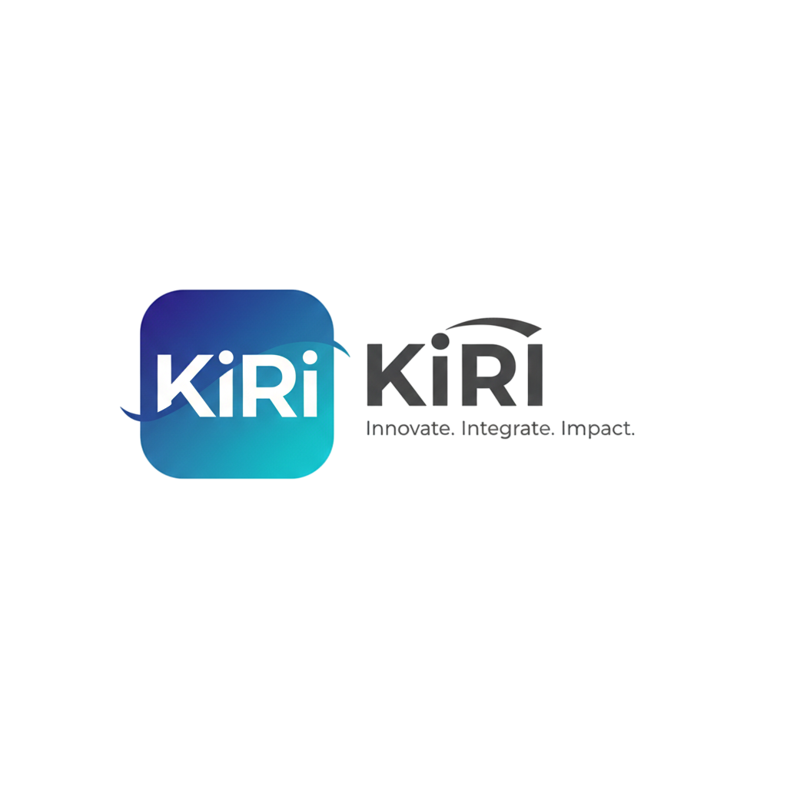
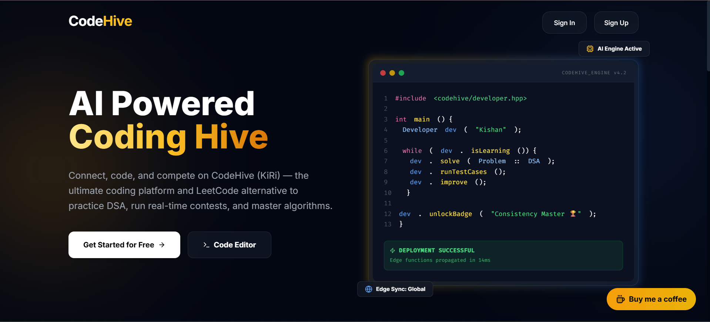

  
  <h1>CodeHive Research Paper</h1>
  
  
<strong>The official research paper and technical documentation for the CodeHive coding platform.</strong>

  

 

  

## 📖 About
**CodeHive** is an advanced coding educational platform built from the ground up to revolutionize the way developers learn and write code. 

Instead of presenting the underlying research as a simple static file, this repository hosts the interactive **CodeHive Research Paper Application**. This web app provides a premium, SaaS-like reading experience detailing the theoretical foundation, platform architecture, and technical breakthroughs behind CodeHive.

## 🚀 Live Demo
Experience the interactive research paper online:
👉 **[View the CodeHive Research Paper (researchpaper-three.vercel.app)](https://researchpaper-three.vercel.app/)**

## ✨ Key Features
- **Immersive 3D Reading**: Interactive book-like page flipping logic for a physical, intuitive reading feel.
- **Ultra High-Definition**: Built on top of PDF.js, ensuring crisp, vector-quality text rendering at any zoom level.
- **Glassmorphic UI**: Minimalist floating dock controls that hide away to maximize the reading area on both desktop and mobile.
- **Premium Aesthetics**: Features a carefully curated dark-mode aesthetic utilizing modern `Outfit` & `Inter` Google Fonts.
- **One-Click Download**: Native download capabilities embedded directly within the UI to grab the original raw PDF.

## 🛠️ Technology Stack
- **Framework**: [React 19](https://react.dev/) + [Vite](https://vitejs.dev/)
- **Styling**: [Tailwind CSS v4](https://tailwindcss.com/)
- **PDF Engine**: `react-pdf` with PDF.js web workers
- **Interactions**: `react-pageflip`
- **Icons**: [Lucide React](https://lucide.dev/)

## 📝 License
This application and the attached research paper are proprietary properties belonging to the creator of CodeHive.
